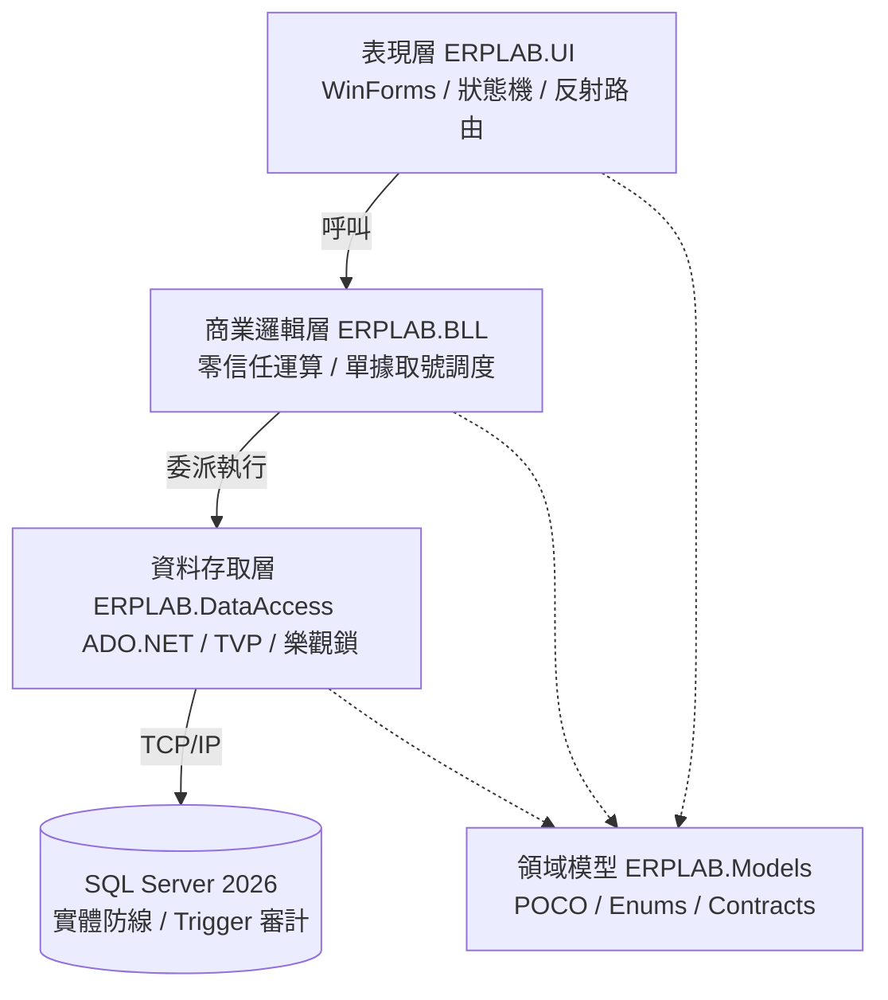

```mermaid
graph TD
    UI[表現層 ERPLAB.UI <br> WinForms / 狀態機 / 反射路由] -->|呼叫| BLL
    BLL[商業邏輯層 ERPLAB.BLL <br> 零信任運算 / 單據取號調度] -->|委派執行| DAL
    DAL[資料存取層 ERPLAB.DataAccess <br> ADO.NET / TVP / 樂觀鎖] -->|TCP/IP| DB[(SQL Server 2026 <br> 實體防線 / Trigger 審計)]
    
    UI -.-> Models[領域模型 ERPLAB.Models <br> POCO / Enums / Contracts]
    BLL -.-> Models
    DAL -.-> Models
```
